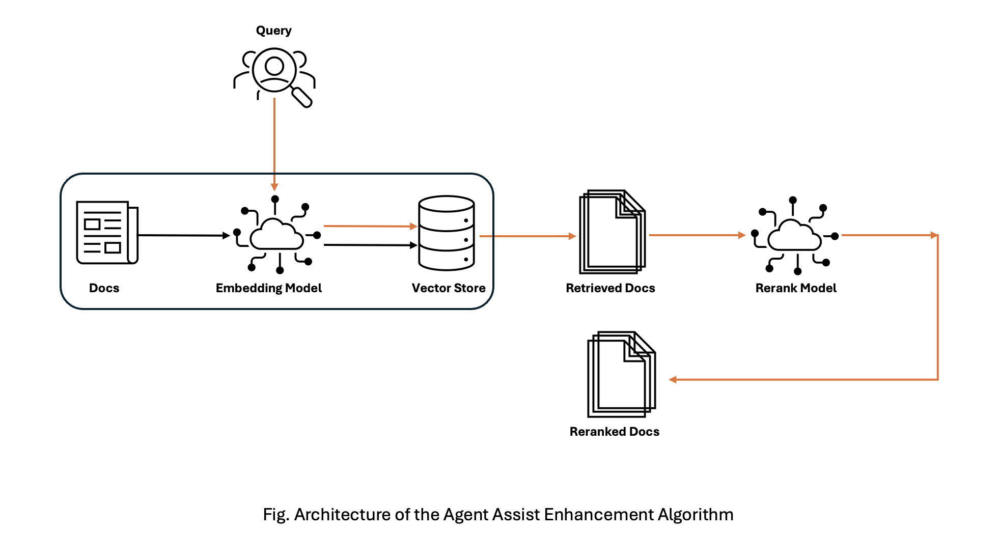

## Architechture
The architechture used in the POC is defined in the image below. We are following a service-oriented architecture where the bigger application is divided into multiple different services where each service provides a specific capability, and services can also communicate with each other. 

### Services:
 - [Elasticsearch as a Vectore Store](#elasticsearch)
 - [Indexing of docs in the vector store](#indexing)
 - [Seach Engine](#search-engine)

#### Elasticsearch
Elastic search was used as the main vector store given its fast, reliable and distributed nature. Despite being a general-purpose DB it offers great vectior search ability. We are hosting an Elasticseach instance using Docker for our POC.

#### Indexing
An indexer scripts runs in a separate docker container and the text documents are first converted into embedding vectors using a [RoBERTa](https://huggingface.co/sentence-transformers/stsb-roberta-large) based sentence encoder and the elasticsearch helpers are then used to index the documents and their embeddings into the Elasticsearch.

#### Search Engine
Any incoming query is first convereted into embeddings using the same sentence encoder and is then matched against the documents stored in vectorstore to give out the initial list of `retrieved` documents. These `retrieved` documents might not have the most relevant documents on top. To re-shuffle these retrieved documents we use a [cross-encoded model](https://huggingface.co/cross-encoder/ms-marco-MiniLM-L-12-v2) for `re-ranking`.

### Closing
Each service is wrapped in a docker container and is orchestrated using a `docker-compose` file to make it OS agnostic. The solution is served using a Streamlit web app and is accessible on `http://localhost:8501/` 